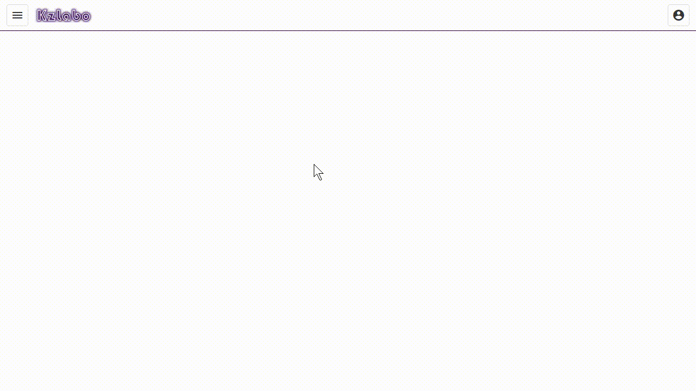
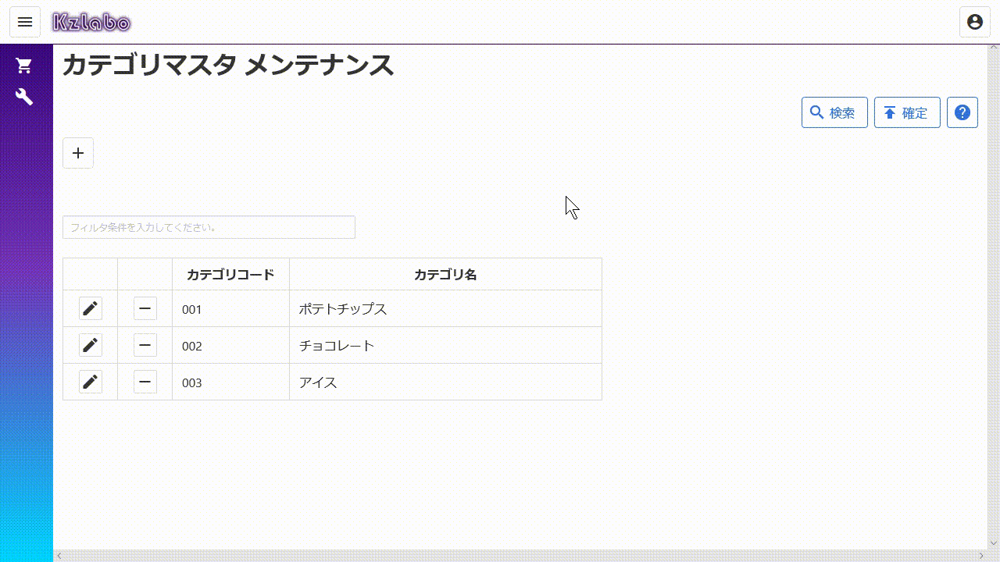
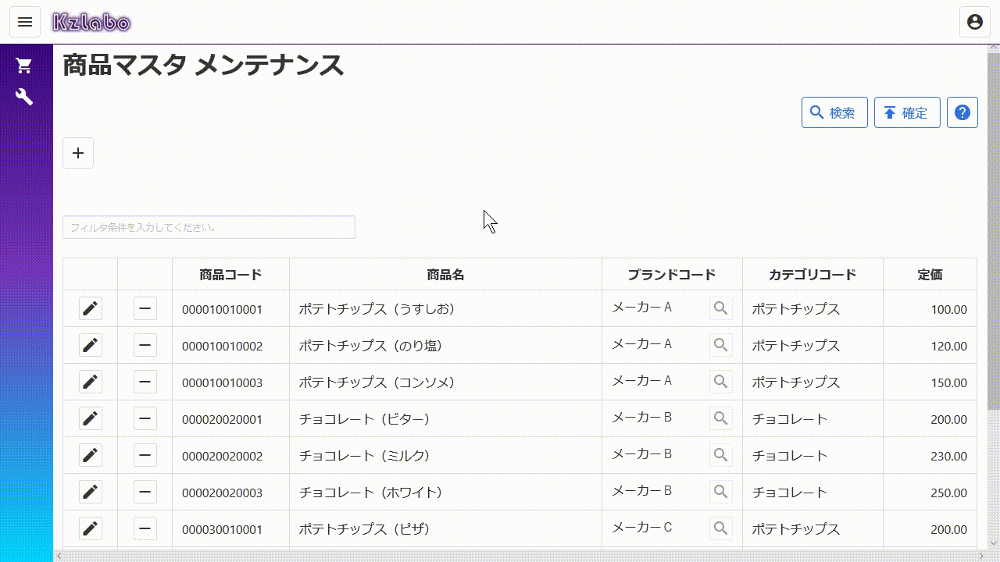

# YaminabeBlazor

Blazor WebAssembly を使った便利コンポーネントおよび業務アプリケーションの開発サンプル。

|Package|License|Nuget|Note|
|:---|:---|:---|:---|
|[YaminabeBlazor.Component](https://github.com/kzlabo/YaminabeBlazor/)|||Blazorコンポーネントライブラリ|
|[YaminabeBlazor.Core](https://github.com/kzlabo/YaminabeBlazor/)|||サンプル|
|[YaminabeBlazor.Db](https://github.com/kzlabo/YaminabeBlazor/)|||サンプル用のデータベース|
|[YaminabeBlazor.Infrastructure](https://github.com/kzlabo/YaminabeBlazor/)|||サンプル|
|[YaminabeBlazor.Web](https://github.com/kzlabo/YaminabeBlazor/)|||サンプル|
|[YaminabeBlazor.Web.Client.Stub](https://github.com/kzlabo/YaminabeBlazor/)|||サンプルをクライアントのみで動作させる為のスタブ|

## javascript を一切使わずに C# と CSS のみでここまでできる

